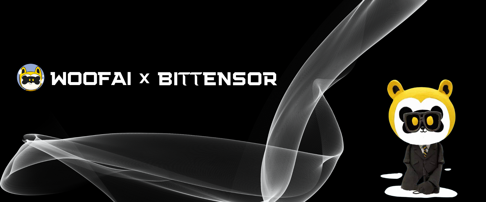

# **WOOF AI** <!-- omit in toc -->

### Bridging Pet Tech and Blockchain Innovation <!-- omit in toc -->

#  introduction

“Woof” is the expression of a dog’s bark. We are developing an AI project designed to analyze and mimic canine behavior. By collecting dog barks uploaded by users, we aim to build a large-scale model to analyze dogs’ emotions and predict their behaviors, fostering a closer emotional bond between humans and dogs. We hope to inspire more people worldwide to become friends with dogs. In the future, we look forward to launching a bionic dog AI for users – Woof woof!

# specificities
*  Smart Contracts: Use smart contracts to automatically enforce pre-set rules and terms, reducing the need for users to understand technical details.
* The Woof Protocol: A Creative New Contract
